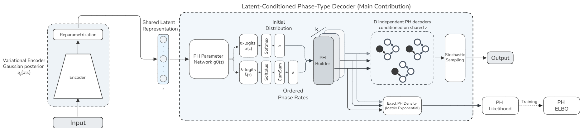

# PH-VAE - ICML 2026

**Paper**: 
- [arXiv version](https://arxiv.org/abs/2603.01800)

**Phase-Type Variational Autoencoder for Heavy-Tailed Data**  
A PyTorch implementation of a multivariate Phase-Type Variational Autoencoder (PH-VAE) for modeling positive-valued continuous and heavy-tailed data.

This work bridges:
- Deep generative modeling
- Applied probability
- Phase-Type distributions
- Heavy-tail statistical modeling

and explores their integration within modern latent-variable learning frameworks.

---
<br>

<p align="center">
  
</p>

<p align="center">
  <em>PH-VAE architecture with latent-conditioned Phase-Type decoder.</em>
</p>

<br>

PH-VAE replaces the classical Gaussian decoder of a Variational Autoencoder with a **latent-conditioned Phase-Type (PH) distribution**. Instead of assuming a fixed parametric likelihood, the decoder learns flexible stochastic processes capable of modeling:

- Heavy-tailed behavior
- Skewed distributions
- Extreme quantiles
- Multivariate dependence through shared latent variables

The repository contains:

- A complete PyTorch implementation of PH-VAE
- Phase-Type likelihood evaluation utilities
- ELBO-based training
- PH sampling routines
- Exploratory notebooks on synthetic and real-world datasets


---

## What the Repo contains:

- Multivariate PH-VAE implementation in PyTorch
- Latent-conditioned Phase-Type decoder
- Exact PH likelihood computation
- Matrix exponential + uniformization methods
- ELBO optimization with KL regularization
- Sampling utilities for Phase-Type distributions
- Heavy-tail modeling for positive-valued data


## Installation

### 1. Create a Python Environment

Python **3.10+** is recommended.

```bash
python -m venv ph_env
source ph_env/bin/activate
```

---

### 2. Install Dependencies

Install the project dependencies from the repository root:

```bash
pip install -r requirements.txt
```

If you plan to run the notebooks, you may also want:

```bash
pip install jupyter ipykernel
```

---

## Usage

### Running the Project

Open the repository in:
- Jupyter Notebook
- VS Code
- JupyterLab

and run one of the notebooks inside `notebooks/`.

> Important: run notebooks from the repository root so imports resolve correctly.

Example imports:

```python
from models import MultiDimPHVAE
from utils import *
```

If running from inside `notebooks/`, change the working directory to the repository root first. First cell does that...

---

## Example Training

```python
from models import MultiDimPHVAE
from models.ph_vae.ph_vae_trainer import train_phvae

model = MultiDimPHVAE(
    input_dim=dim,
    latent_dim=10,
    n_phases=15
)

train_phvae(
    model,
    train_loader,
    epochs=100,
    learning_rate=1e-3
)
```

---

## Checkpoints

A pretrained checkpoint with Weibull data is available in:

```text
models/saved/phvae_weibull.pt
```

It can be used for:
- Inference
- Sampling
- Evaluation
- Visualization

---

## Example Applications

- Financial risk modeling
- Insurance losses
- Reliability analysis
- Word-frequency modeling
- Rare-event generative modeling

---

## Citation

```bibtex
@article{ziani2026phvae,
  title={Phase-Type Variational Autoencoders for Heavy-Tailed Data},
  author={Ziani, Abdelhakim and Horvath, Andras and Ballarini, Paolo},
  journal={arXiv preprint arXiv:2603.01800},
  year={2026}
}
```

---


